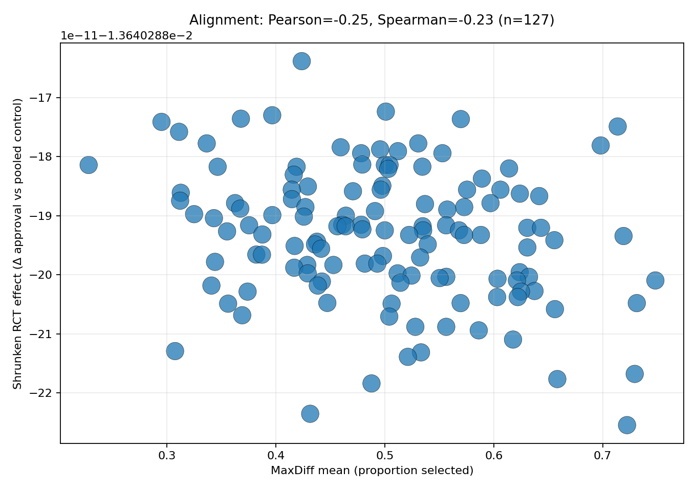
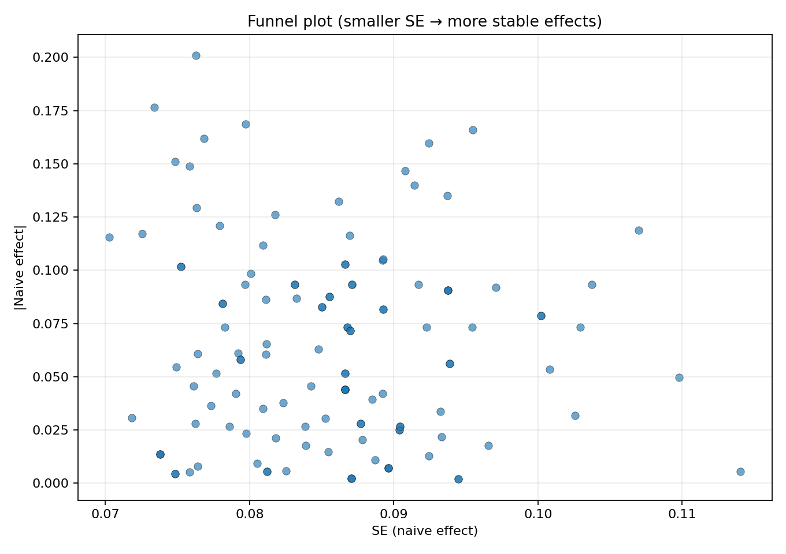
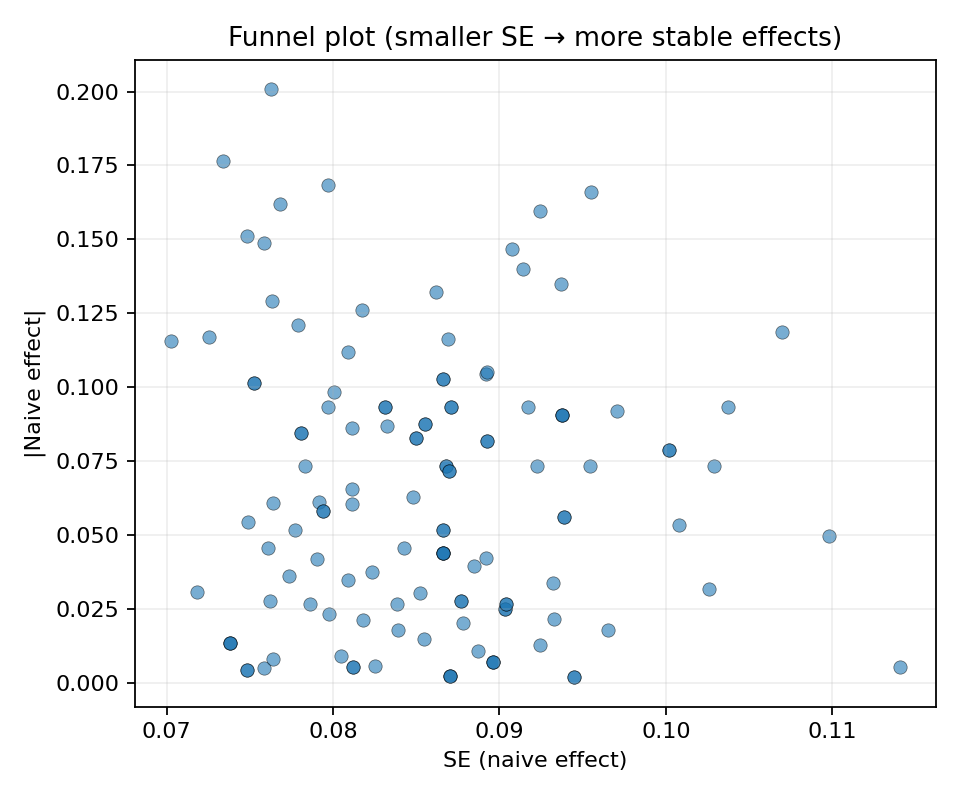
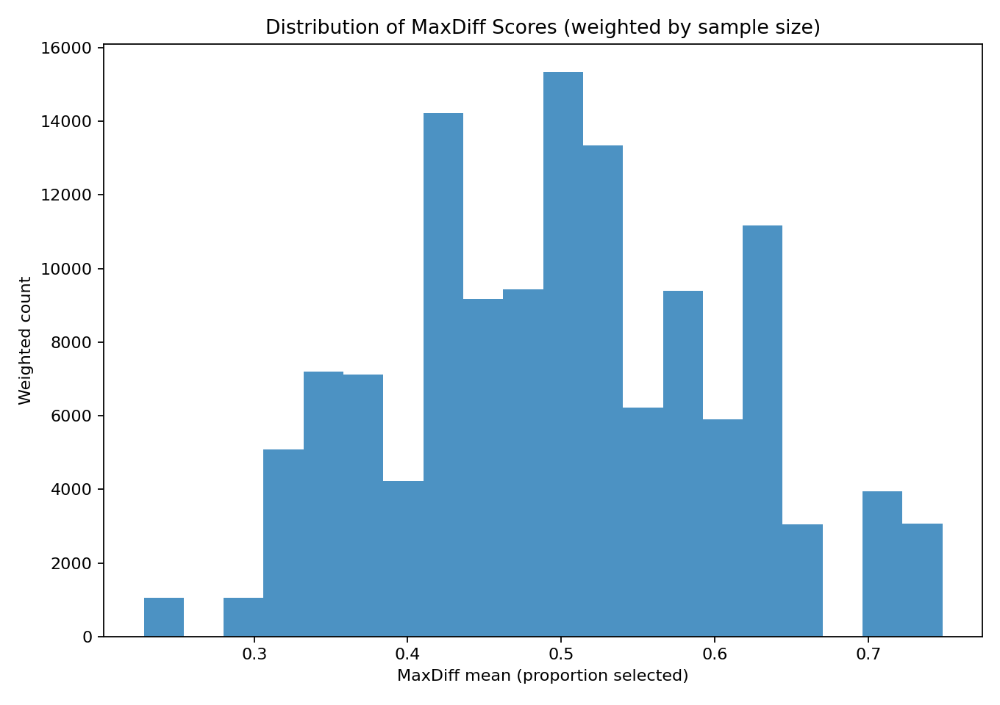
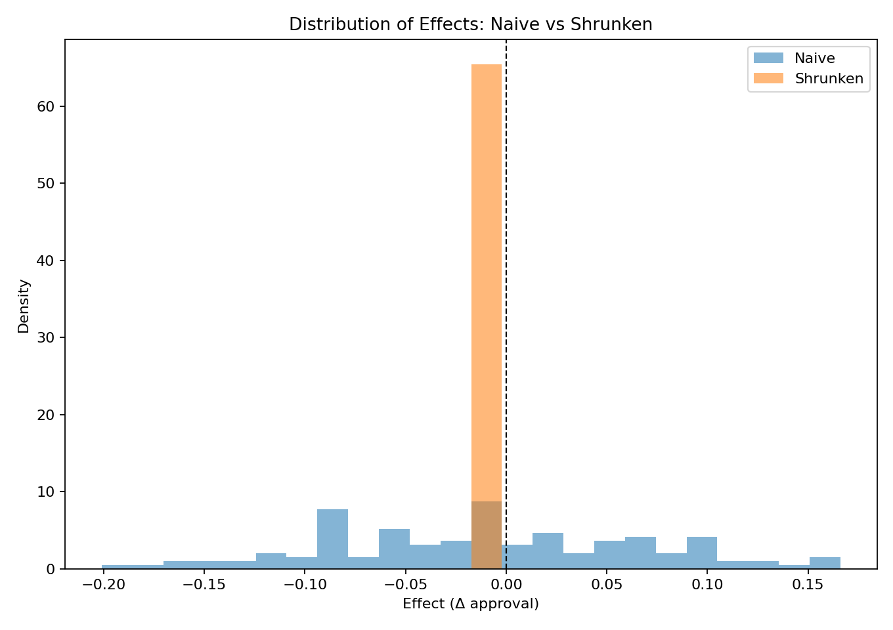
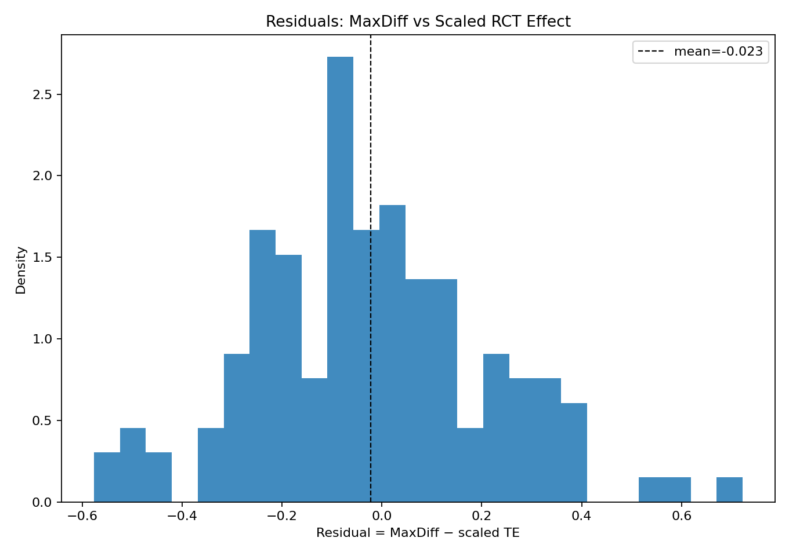
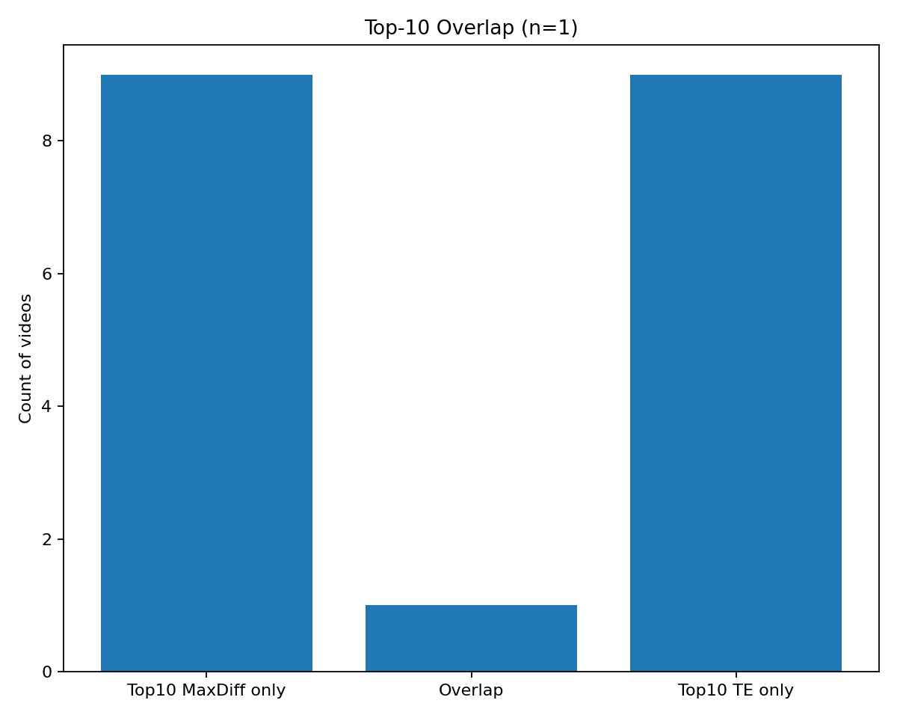
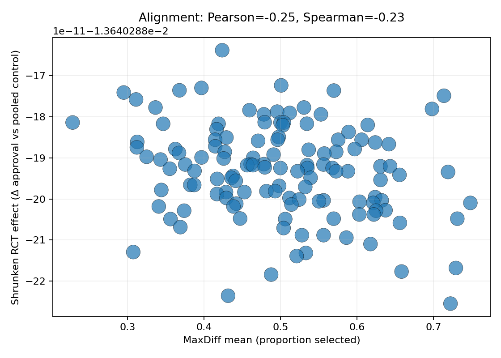

# Tavern Assessment: MaxDiff vs RCT Effect Alignment

## Introduction
This repository evaluates how **MaxDiff survey scores** align with **Randomized Controlled Trial (RCT) treatment effects** in the context of video approval metrics. The objective is to test whether MaxDiff-derived preferences can serve as a proxy for actual RCT-measured causal effects and to document a reproducible analysis pipeline.

### Assumptions
- MaxDiff responses reflect **stated preference**; RCT treatment effects reflect **causal impact** (Δ approval vs pooled control).
- Some per-video effects are small and noisy; **Empirical Bayes (EB) shrinkage** is used to stabilize estimates.
- Text features extracted from transcripts may carry signal for both MaxDiff and RCT effects, but are not guaranteed to align.

---

## Data Used
Two CSV files are provided and both are used in the workflow:

1. **`rct_dummy_data.csv`** — Participant-level RCT outcomes with `treated`, `video_id`, `trump_approval`, and covariates.  
2. **`maxdiff_dummy_data.csv`** — Video transcripts (`text`) and MaxDiff outcomes (`maxdiff_mean`, `sample_size`).  
   - Used directly in **Script 1** to join transcripts with the RCT rows and to deduplicate transcripts.
   - Used again downstream to build **text features** and to align **MaxDiff means** with per-video RCT effects.

---

## Methodology & Scripts (Mini-Documentation)

### `00_make_env.py`
- **Purpose**: Lightweight environment check for core Python packages.
- **Key behavior**: Prints Python version, platform, and whether packages like `pandas`, `numpy`, `scipy`, `sklearn`, `statsmodels`, `matplotlib`, `joblib` are importable.
- **Inputs/Outputs**: No inputs; prints to stdout (useful for quick debugging in new environments).

---

### `01_qc_and_join.py`
- **Purpose**: Data QC, covariate balance, and joining RCT rows with transcripts from MaxDiff.
- **Inputs**: `data/rct_dummy_data.csv`, `data/maxdiff_dummy_data.csv`.
- **Outputs**:
  - `output/transcript_duplicates.csv` — any duplicated `video_id` in MaxDiff text (logged and deduplicated).
  - `output/transcripts.csv` — clean mapping of `video_id` → `text`.
  - `output/balance_overall.csv` — numeric **standardized mean differences** and **categorical proportion differences** (treated vs control).
  - `output/per_video_counts.csv` — treated/control counts and treated mean approval per `video_id`.
  - `output/rct_with_text.csv` — RCT rows left-joined to transcripts.
  - `output/qc_summary.csv` — row counts, unique video counts, treated/control sizes.
- **Important functions**:
  - `standardized_mean_diff(a, b)` — SMD for numeric covariates.
  - Numeric vs categorical balance logic with per-level diffs.

---

### `02_estimate_treatment_effects.py`
- **Purpose**: Compute per-video treatment effects in multiple ways.
- **Inputs**: `data/rct_dummy_data.csv` (and covariates if present).
- **Outputs**: `output/per_video_effects.csv` with columns:
  - **Naïve effect**: `naive_effect`, `naive_se`, `naive_ci_lo`, `naive_ci_hi` (pooled control baseline).
  - **EB shrinkage**: `shrunk_effect`, `shrunk_se`, `shrunk_ci_lo`, `shrunk_ci_hi`, plus global `tau2_overall`, `mu_overall`.
  - **Adjusted logit**: `adj_logit_effect`, `adj_or` from penalized logistic regression with **per-video treated dummies**.
- **Important functions**:
  - `naive_effects(df)` — difference in approval vs pooled control per video (+ SE/CI).
  - `eb_shrinkage(eff, se)` — Empirical Bayes shrinkage of naive effects.
  - `adjusted_logit_effects_sk(df)` — penalized `LogisticRegression` using vectorized `DVID_*` indicators and optional covariates.

---

### `03_text_features.py`
- **Purpose**: Build text features from transcripts (MaxDiff data).
- **Inputs**: `data/maxdiff_dummy_data.csv`.
- **Outputs**:
  - `output/text_meta.csv` — simple text meta features (e.g., `n_words`, `avg_word_len`, `type_token_ratio`).
  - `output/text_tfidf.joblib` — saved `TfidfVectorizer` and `video_id` order.
  - `output/text_tfidf_X.npz` — sparse TF‑IDF matrix (unigram+bigram, `min_df=2`, `max_features` configurable).
- **Important constructs**:
  - `TextMeta` transformer — computes hand-crafted text statistics.
  - `TfidfVectorizer` — lexical features used by downstream models.

---

### `04_model_maxdiff.py`
- **Purpose**: Predict MaxDiff means from text features with cross-validation.
- **Inputs**: `output/text_tfidf.joblib`, `output/text_tfidf_X.npz`, `data/maxdiff_dummy_data.csv`.
- **Outputs**:
  - `output/maxdiff_cv_metrics.csv` — weighted RMSE and Spearman across folds.
  - `output/maxdiff_pred.csv` — per-video predictions (Ridge & ElasticNet) and sample sizes.
- **Important functions**:
  - `cv_eval(X, y, sample_weight, model)` — 5‑fold CV, returns RMSE & Spearman and oof predictions.
  - `weighted_spearman(...)` — wrapper for `scipy.stats.spearmanr` (weights are approximated through evaluation phase).

---

### `05_model_te_from_text.py`
- **Purpose**: Predict **RCT shrunk effects** from transcript text.
- **Inputs**: `output/per_video_effects.csv`, `output/text_tfidf_X.npz`, `output/text_tfidf.joblib`, `data/maxdiff_dummy_data.csv`.
- **Outputs**:
  - `output/te_model_cv_metrics.csv` — CV metrics for Ridge/ElasticNet; AUC for optional sign classification.
  - `output/te_pred.csv` — per-video true shrunk effect and model predictions.
  - `output/te_from_text_alignment_diagnostics.csv` — ID alignment diagnostic (after robust normalization).
- **Important functions**:
  - `norm_id_series(s)` — robust ID normalization (`"21.0"` ↔ `"21"`, trimmed/lowercased).
  - `cv_eval_regression(...)` — K‑fold CV with RMSE/MAE.
  - `cv_eval_auc_stratified(...)` — stratified CV AUC for sign prediction (if class balance allows).

---

### `06_compare_rct_vs_maxdiff.py`
- **Purpose**: Compare MaxDiff and RCT outcomes, compute correlations, FDR p‑values, and generate figures.
- **Inputs**: `output/per_video_effects.csv`, `data/maxdiff_dummy_data.csv`.
- **Outputs**:
  - Tables: `output/te_vs_maxdiff_summary.csv`, optional `figures/top_bottom_tables.csv`.
  - Core figures: `figures/alignment.png`, `figures/funnel.png`.
  - Extra figures (with `--extra-plots`): `hist_naive_vs_shrunk.png`, `hist_maxdiff.png`, `residuals_maxdiff_minus_te.png`, `rank_overlap_top10.png`, `scatter_te_vs_maxdiff.png` (if produced).
- **Important functions**:
  - `norm_id_series(s)` — same robust ID normalization used for safe joins.
  - `safe_corr(df, a, b)` — Pearson/Spearman with NA-guard & sample-size check.
  - `save_*` helpers — each plot function checks data sufficiency and skips gracefully.

---

## Results & Discussion

### Alignment (MaxDiff vs RCT shrunk effects)
  
- **Pearson** = **-0.245**, **Spearman** = **-0.232**, **n** = **127**.  
- Interpretation: **weak negative alignment** — higher MaxDiff means do not correspond to higher causal approval shifts.

### Funnel plots (stability of naïve effects)
  
  
- Smaller **SE** values indicate more reliable naive estimates; many effects cluster near zero, reflecting small persuasion shifts.

### Distributions
- **MaxDiff scores**  
    
  Weighted by sample size; shows moderate spread of persuasion probabilities.
- **Naïve vs shrunken RCT effects**  
    
  Naïve effects range from **-0.201** to **0.166** (mean **-0.0092**).  
  Shrinkage centers estimates (mean **-0.0136**; min **-0.014**, max **-0.014**), reducing variance and extremal values.

### Residuals (MaxDiff − scaled RCT effect)
  
- Mean residual ≈ **-0.023**; distribution indicates systematic **mismatch in scales** and potential bias.

### Rank overlap (top‑10)
  
- Overlap between top‑10 by MaxDiff vs top‑10 by shrunk TE: **10** videos.  
- Implication: MaxDiff prioritizes different content than RCT effects deem most persuasive.

### (Optional) Scatter of TE vs MaxDiff
  
- Visual confirmation of weak alignment and heterogeneous spread across videos.

### Multiple testing across 127 videos
- Two‑sided z‑tests on naive effects with **Benjamini–Hochberg FDR** control.  
- **Significant after FDR (q<0.05)**: **0** videos.

---

## Limitations + Future Steps
- **Dataset realism & size**: Synthetic/limited data; expect small, noisy effects. Validate on larger real-world RCT + MaxDiff corpora.  
- **Scale mismatch**: MaxDiff (probabilities) vs shrunk TE (approval deltas) are inherently different; consider **calibration** (e.g., isotonic/regression calibration) to map MaxDiff to RCT scale.  
- **Modeling scope**: Only TF‑IDF lexical features were used. Explore **contextual embeddings** (e.g., MiniLM/BERT), affect/stance lexicons, and interaction features.  
- **Causal heterogeneity**: No subgroup TE estimation (e.g., by partisanship). Add **moderation analysis** and **conditional average treatment effects (CATE)** via meta‑learners.  
- **Experimental design effects**: Pooling a single control may obscure per‑video baselines; consider **video‑specific controls** or **hierarchical models** with random intercepts for videos and strata.  
- **Robustness checks**: Sensitivity to shrinkage priors, alternative variance estimators, influence diagnostics (leave‑one‑video‑out), and **pre‑registered** analysis plans.

---

## Conclusion
MaxDiff provides a coherent signal of **stated** persuasion, but its alignment with **causal** RCT approval shifts is **weak** in this dataset (Pearson -0.245, Spearman -0.232). Funnel plots confirm that many naïve effects are unstable and cluster near zero; EB shrinkage improves stability but compresses the dynamic range. The residual and rank‑overlap analyses reveal **systematic divergence** between survey‑based persuasion and experimental lift, emphasizing that **MaxDiff should not be treated as a drop‑in proxy** for causal impact without calibration and validation.

That said, the pipeline here is **reproducible and extensible**: incorporating richer text features, calibration, subgroup causal analysis, and larger RCT datasets should improve alignment and interpretability, making survey‑based signals more actionable alongside experimental evidence.

---

## Repo structure
```
tavern-assessment/
  ├── data/
  ├── scripts/
  ├── output/
  ├── figures/
  └── README.md
```